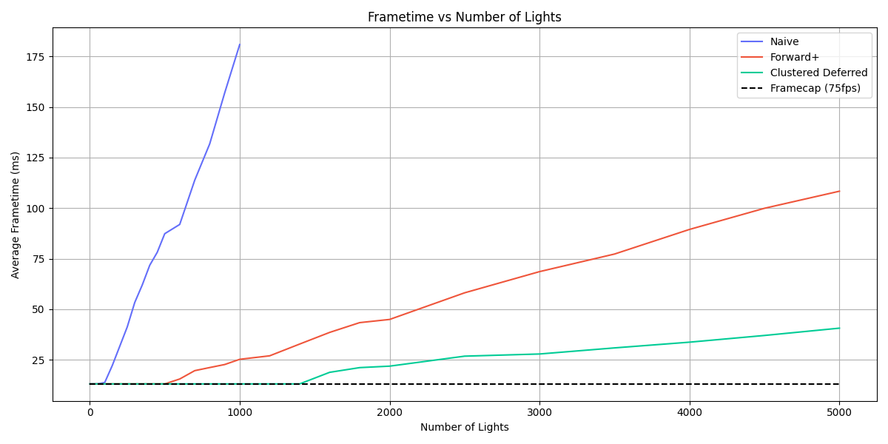
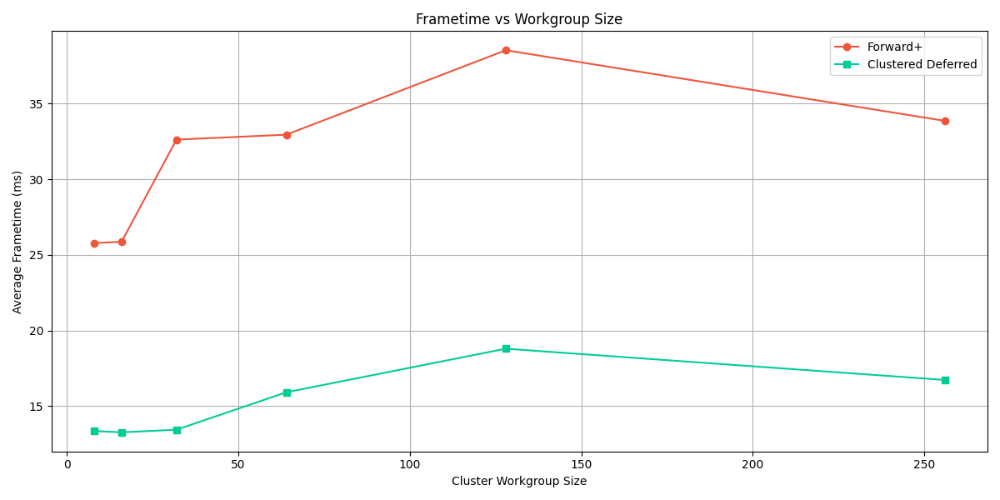
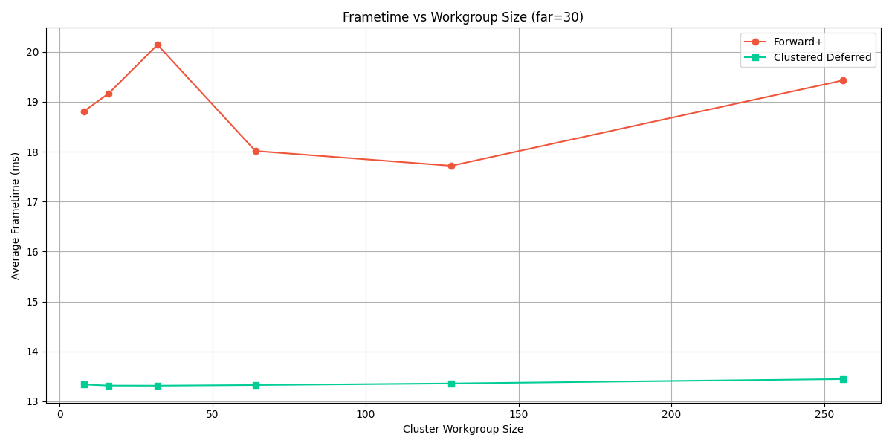
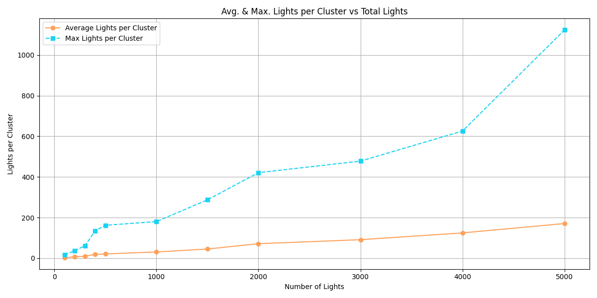
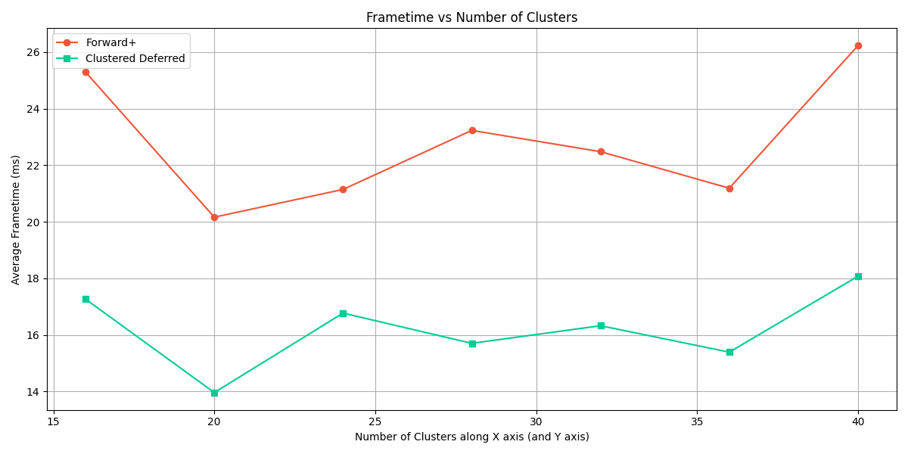
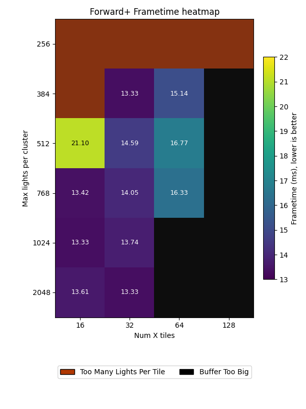

**University of Pennsylvania, CIS 5650: GPU Programming and Architecture, Project 4**

* Yannick Gachnang
  * [LinkedIn](https://www.linkedin.com/in/yannickga/)
* Tested on: Windows 10, EPYC 9354 @ 3.25GHz, 16GB RAM, RTX 2000 Ada 23GB VRAM

Project 4 WebGPU Forward+ and Clustered Deferred Shading
====================

**Live Demo can be found [here](https://krispy-kenay.github.io/Project4-WebGPU-Forward-Plus-and-Clustered-Deferred/)**

## Demo GIF

[](https://krispy-kenay.github.io/Project4-WebGPU-Forward-Plus-and-Clustered-Deferred/)
<br>
<sub>*Sponza with 5000 lights running at around 20 fps using deferred rendering*</sub>

## Implementation

### Naive

The starting point was the baseline forward renderer. Each fragment directly loops through all lights in the scene, performing per-light shading without any form of culling. The camera uniform was completed so that the view-projection matrix is uploaded every frame and used by both the vertex and fragment stages. The fragment shader takes the world-space position and normal and accumulates contributions from the full light array stored in a structured buffer. This establishes the reference behavior for correctness, but it scales with the number of lights times the number of shaded fragments.

### Forward+

The next stage introduces clustered shading. The guiding idea is that most lights affect only a limited spatial region, so instead of shading with all of them, each fragment should consider only those within its cluster. The view frustum is subdivided into a regular 3D grid of clusters, defined by 2D screen tiles and a set of depth slices. Each cluster stores a list of light indices that intersect it. This structure is rebuilt every frame by a compute shader that tests each light’s bounding sphere against the axis-aligned bounds of the clusters.

The clustering compute pass is implemented in `clustering.cs.wgsl` using a configurable workgroup size. Each invocation corresponds to one light. The shader transforms the light center to view space, computes its near and far intersection depths, and determines which slices and tiles it overlaps. For every cluster in that range, an atomic counter is incremented to append the light index into a global index buffer.

The clustering pass depends on a depth-to-slice function that partitions the frustum linearly between the camera near and far planes. The fragment path of Forward+ uses the resulting cluster buffers. Each pixel computes its tile and slice index from screen coordinates and view-space depth, reconstructs a cluster index, and then loops only through the subset of lights stored there. The relevant bindings are visible in the fragment shader:

```ts
@group(...) @binding(2) var<storage, read> counts  : ClusterCountsRO;
@group(...) @binding(3) var<storage, read> indices : ClusterIndicesRO;

```
and each fragment executes:
```ts
let zSlice = slice_from_depth_linear(depth, camera.nearFar.x, camera.nearFar.y);
let clusterIdx = cluster_index(tileX, tileY, zSlice, nx, ny);
let lightCount = min(counts.data[clusterIdx], MAX_LIGHTS_PER_CLUSTER);
```

followed by a loop over lightCount elements to shade only relevant lights. This is the main behavioral change from the naive version.

### Clustered Deferred

The final stage adapts the same clustering logic to a deferred pipeline. The clustering compute step remains identical, but the geometry and lighting stages are separated. The geometry pass outputs a G-buffer containing position, normal, and albedo. The relevant shader in `clustered_deferred.fs.wgsl` writes three color targets:

```ts
struct GBufferOutput {
    @location(0) posOut    : vec4f,
    @location(1) normalOut : vec4f,
    @location(2) albedoOut : vec4f,
};
```

The fullscreen pass in `clustered_deferred_fullscreen.fs.wgsl` reads from these textures, reconstructs view-space position from the depth component, and performs clustered lighting identical to the Forward+ path.

Within the fragment function, the slice computation is reused verbatim, ensuring consistent clustering behavior between Forward+ and Deferred. The TS setup dispatches two passes per frame:
1. the G-buffer pass writing three render targets
2. the fullscreen pass performing the light accumulation

Both are bound through WebGPU’s `setPipeline` and `setBindGroup` calls in `clustered_deferred.ts`.

## Performance Analysis

All results below are averaged over three runs of 100 frames per run. Unless stated otherwise, the cluster grid used 42 tiles along the x-axis, 24 tiles along the y-axis, 12 slices along the z-axis and a maximum of 2048 lights per cluster. This is just barely under the maximum buffer size allowed by WebGPU (134217728 bytes $\approx$ 128 MB), while still allowing for more than enough space for lights in clusters.

### Number of lights

Forward+ and Clustered Deferred run steady at the monitor's framerate cap while the light count is small and then diverge as clusters begin to saturate. At 1000 lights, Forward+ is about 25.23 ms and Clustered Deferred sits near the refresh ceiling at 13.07 ms. Naive rendering collapses to 180.83 ms at the same point. At 5000 lights the gap grows further with Forward+ reaching 43.23 ms, while Clustered Deferred is at 22.41 ms. 


<br>
<sub>*Naive frametimes above 1000 lights were excluded for brevity, the scaling trend continues similarly otherwise*</sub>

Clustered Deferred is typically faster at high light counts because the geometry cost is decoupled from shading. Forward+ competes well in the mid-range but degrades sooner as cluster occupancy grows.

### Workgroup size

The first sweep of compute workgroup sizes in the figure below shows that smaller workgroups vastly outperform larger workgroups.



This is odd, typically one would expect that workgroup sizes in the range between 64 and 128 would be the sweet spot. After some additional performance readouts were implemented, a problem became obvious: 91.7 % of clusters were empty at both 20 and 2000 lights. Relating this to the number of z-depth slices, $11/12 = 0.917$ implies that only a single z-plane of clusters is populated with lights. The clusters are partitioned into 12 slices along the z-axis between the near and far plane of the camera and are set to:

```typescript
static readonly nearPlane = 0.1;
static readonly farPlane = 1000;
```
Adjusting the far plane became necessary to distribute lights more evenly along the z-axis, in this instance `farPlane = 30` was chosen to retain nearly identical rendering behavior. With this change, occupancy spread improved and empty clusters dropped to 41 % at 2000 lights. Forward+ at 1600 lights now hovers around 17-19 ms with the best case at a workgroup size of 128 at 17.72 ms, and Deferred around the framerate cap of 13.36 ms in the new graph below. This pattern is more in line with what one expects on modern GPUs, where very small groups under-utilize the machine and very large groups can increase contention or spill.




Now the results from the previous section need to be re-evaluated. Since both Forward+ and Clustered Deferred use the same clustering computation pipeline, the results should stay relative to each other. Re-running the same test at 5000 lights but with `farPlane = 30` lands at 43.23 ms for Forward+ and 22.41 ms for Deferred. Both cases see a big jump in performance, but confirm that the relative gap remains similar. Therefore, the extensive test from earlier doesn't need to be recreated since only the point at which the methods start to diverge changes while the overall shape of the curves remain similar.

*(Side note: For this analysis the linear layout was kept on purpose, since it makes other failure modes and probblems more visible.)*

### Cluster occupancy

With the adjusted far plane, the average lights per cluster rose from 2.41 at 100 lights to 170.58 at 5000 lights. The maximum climbed faster, reaching 1124 in a single cluster. That seems to indicate the practical limit for Forward+, because even if the mean looks acceptable, one or two saturated clusters can throttle the light-assignment pass with atomic contention and stretch the fragment-side loops. Deferred suffers less from this because the expensive material fetch work is already done in the geometry pass.



A more aggressive depth partition (logarithmic slices, or simply more slices although the current settings are limited by the WebGPU maximum buffer sizes) would likely flatten the tail of the max curve. That would lower the worst-case loop length for Forward+ and reduce atomic pressure in both pipelines.

Below is a debug visualization from an earlier run (before the far-plane adjustment) showing clusters that reached the per-cluster light cap turning red:


### Tile Density

During early tests, cluster tile sizing was defined in pixels (for example 32 px * 32 px). While this produced predictable results on one display resolution, it broke consistency across machines.
Increasing the screen resolution directly increased the number of clusters, even though the physical extent of the scene did not change. This caused inconsistency in buffer allocation and could cause WebGPU’s 128 MB per-buffer limit to be exceeded when switching screens

To make behavior resolution-independent, the implementation was refactored to specify the number of tiles along the X-dimension, automatically deriving the Y-dimension so that tiles remain roughly square. This keeps clustering behavior consistent regardless of output resolution or aspect ratio. Frametime performance was (re)tested at 2000 lights, 12 Z-slices, workgroup = 128, and a maximum of 2048 lights per cluster while sweeping over the a range of tile counts.



Results varied slightly between runs (occasionally hitting the 75 FPS cap) but the trend was towards medium-low tile densities (20 to 24 tiles along the x-axis). However, this test compared configurations with different total buffer sizes because the maximum lights-per-cluster value stayed fixed. As tile count grows, the buffer expands, so performance differences could come from GPU memory pressure rather than pure algorithmic efficiency.

To separate those effects, a 2D sweep was run across tile densities and per-tile light limits. Each combination determines the total cluster-light buffer size. The resulting heatmap shows the practical range before hitting allocation or overflow limits:



The heatmap results turned out to be less straightforward than expected. Increasing the number of tiles (smaller tiles) did not consistently improve performance. In fact, configurations with fewer (larger) tiles often ran faster, even though they should in theory have heavier per-cluster workloads. Furthermore, the combinations of 32 tiles & 384 max lights per tile and 32 tiles & 2048 max lights per tile produced almost identical frame rates, while intermediate setups with 32 tiles performed slightly worse. Some of this inconsistency can be attributed to normal run-to-run noise, but the broader pattern suggests a more complex interaction between the various factors at play. It implies that neither tile density nor per-cluster capacity alone predicts efficiency well. Combined with the earlier observation about uneven z-axis clustering these results point to the need for a more adaptive scheme, like using logarithmic depth slicing to even out cluster load before fine-tuning tile density.

## Conclusion

Clustered Deferred is the safer choice for scenes with many lights and deep overdraw. Forward+ remains appealing in leaner scenes or when you want to avoid a G-buffer, but it is more sensitive to cluster imbalances. Both pipelines depend heavily on parameterization like depth slicing, tile size, and workgroup size. The measurements above are consistent with that. They also show why it’s worth validating cluster occupancy before micro-tuning shaders, because if distribution is off, no amount of workgroup fiddling will fix it.


## Credits

- [Vite](https://vitejs.dev/)
- [loaders.gl](https://loaders.gl/)
- [dat.GUI](https://github.com/dataarts/dat.gui)
- [stats.js](https://github.com/mrdoob/stats.js)
- [wgpu-matrix](https://github.com/greggman/wgpu-matrix)
